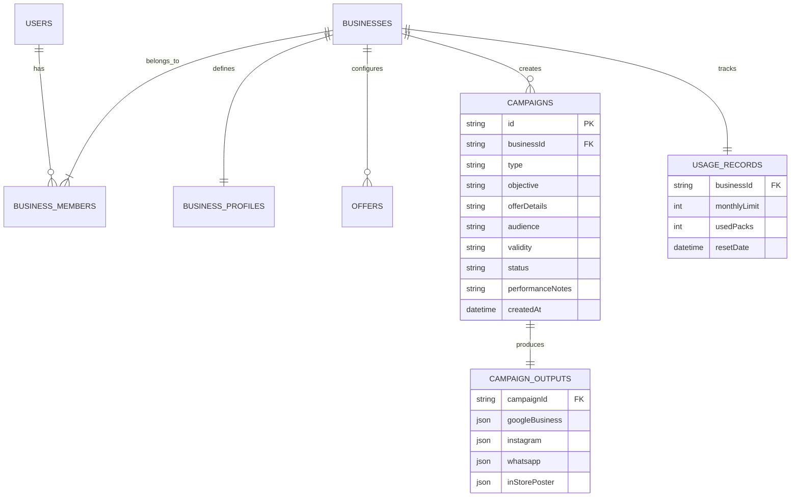

# StreetCraft: Local Business Growth Engine (V1 MVP Specification)

**Positioning**: *Turn one offer or moment into everything your local customers need to see.*

StreetCraft is a local business campaign engine built for cafes and restaurants. It converts a single business opportunity (slow weekday, weekend crowd, new dish, festival, review spotlight) into an integrated multi-channel campaign pack (Google Business, Instagram, WhatsApp, In-Store Poster) backed by permanent Business Memory.

---

## User Review Required

> [!IMPORTANT]
> **Refined V1 Architecture & Scope Decisions:**
> 1. **Streamlined 5-Route App Scope (Public vs App)**:
>    - Public: `/` (Landing), `/free-tool` (Acquisition Machine), `/pricing` (Plans & ROI), `/login` (Authentication).
>    - Workspace (`/app`):
>      - `/app/dashboard`: Deterministic Daily Morning Briefing (3 proactive opportunities based on business context).
>      - `/app/business`: Permanent Business Profile & Marketing Context Engine.
>      - `/app/create`: Core 4-step Campaign Engine (What is happening -> Desired outcome -> Offer details -> Multi-channel Pack).
>      - `/app/campaigns`: Structured Campaign History & Performance Vault.
>      - `/app/settings`: Account, Usage Metering (5 / 100 / 300 packs/mo), and Subscription Status.
>    - *Post-PMF (Deferred to V2)*: `/app/visibility` (deferred until direct OAuth Google Business API integration is in place).
> 2. **Hybrid Engine & Structured Campaign Schema**:
>    - Validation -> Deterministic Schema & Constraints -> AI Phrasing Adapter -> Output Validator.
>    - Deterministic Layer owns: schemas, character limits, call-to-action structures, formatting, category vocabulary, and festival dates.
>    - Generative Layer owns: hooks, variations, tone, and localized phrasing (with local relevance enrichment, zero keyword stuffing).
> 3. **Structured Data & Usage Metering Architecture**:
>    - Relational entities: `users`, `businesses`, `business_profiles`, `offers`, `campaigns`, `campaign_outputs`, `usage_records`.
>    - Usage metering enforced across plans: Free (5 packs/mo), Pro (100 packs/mo), Growth (300 packs/mo).
> 4. **Strict No-Emoji Policy**: Enforced across all UI copy, generated copy, and codebase.

---

## Technical Architecture & File Layout

```
src/
├── types/
│   └── schema.js            # Structured definitions: Campaign, BusinessProfile, UsageRecord
├── store/
│   └── db.js                # Relational data layer, session management, and usage metering
├── engine/
│   ├── rules.js             # Category vocabulary, channel limits, and local relevance rules
│   ├── campaignEngine.js    # Hybrid generation engine (Deterministic + AI Phrasing Adapter)
│   └── dailyBriefing.js     # Deterministic opportunity generator (rules-based morning brief)
├── components/
│   ├── Navigation.jsx       # Public navigation with login / launch buttons
│   ├── Footer.jsx           # Clean minimal footer
│   └── ChannelCard.jsx      # Reusable multi-channel output viewer (Google, IG, WhatsApp, Poster)
├── views/
│   ├── LandingPage.jsx      # High-converting landing page with ROI framework and cafe proof
│   ├── FreeToolPage.jsx     # Acquisition machine: "Create my local promotion"
│   ├── PricingPage.jsx      # Transparent usage-metered plans with ROI baseline calculator
│   ├── LoginPage.jsx        # Clean auth and session initialization
│   └── app/
│       ├── AppShell.jsx     # Modern SaaS sidebar, header, and route switcher
│       ├── DashboardView.jsx# Daily briefing & proactive opportunity cards
│       ├── BusinessView.jsx # Business Profile & Marketing Context editor
│       ├── CreateCampaignView.jsx # Core 4-step campaign creator
│       ├── CampaignsView.jsx# Structured campaign history, status, and performance notes
│       └── SettingsView.jsx # Usage metering and plan management
├── main.jsx                 # Router, state bindings, and app entry point
└── styles.css               # Ultra-modern dark/light SaaS styling (Linear/Raycast inspired)
```

---

## Data Schema & Relational Design



---

## Verification Plan

### Automated Build Verification
- Execute `npm run build` or `npx vite build` to ensure 100% clean compilation.

### Manual Verification
1. **Public Funnel & Free Tool**:
   - Test Landing page ROI baseline calculation.
   - Run `/free-tool` to generate a sample cafe campaign pack and verify one-click copy and upgrade trigger.
2. **Business Memory Engine**:
   - Open `/app/business`, update shop profile (e.g., "The Roasted Bean", "Indiranagar, Bengaluru", "Specialty Coffee & Breakfast"), and verify persistent storage in the data store.
3. **Core Campaign Engine (`/app/create`)**:
   - Complete the 4-step wizard for a "Slow Weekday Afternoon" boost.
   - Verify that all 4 channel outputs (Google Business, Instagram, WhatsApp, Poster) conform to channel limits, correct call-to-actions, and localized phrasing.
   - Verify usage meter increments appropriately.
4. **Daily Briefing (`/app/dashboard`)**:
   - Verify that the morning briefing computes deterministic opportunities (e.g., missing weekday promotion, pending campaign replacement).
5. **Campaign History (`/app/campaigns`)**:
   - Verify campaign status toggles (Draft, Published, Completed), performance notes, and export features.
